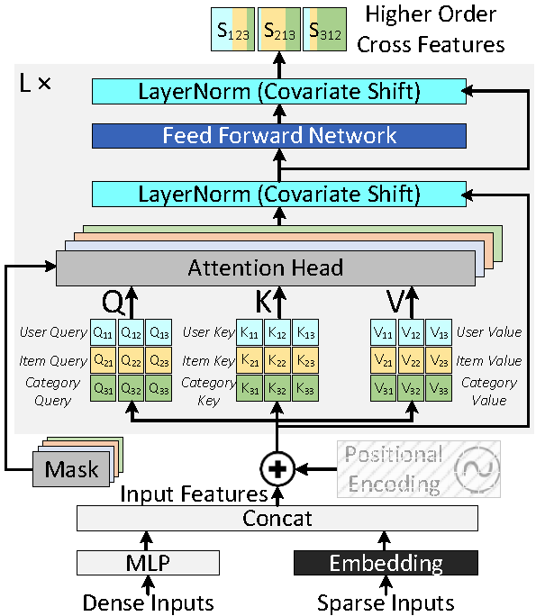

# MTRec - MTRec: Transforming Recommender Models with Advanced Feature Interactions

<br>
<div style="text-align: center; margin: 20pt">
  <figcaption style="font-style: italic;"></figcaption>
</div>

This repository contains the MTRec based feature interaction layer for faster training and convergence of recommendation models.

## Dataset Pre-processing

Publicly available datasets (Criteo Kaggle, Criteo Terabyte etc) can be downloaded and required pre-processing for training.

Follow below steps for downloading raw datasets and then pre-processing the required dataset for training purpose.

```
     cd MTRec

```
1) The code supports interface with the [Criteo Kaggle Display Advertising Challenge Dataset](https://labs.criteo.com/2014/02/kaggle-display-advertising-challenge-dataset/).
   - Please do the following to prepare the dataset for use with DLRM code:
     - First, specify the raw data file (train.txt) as downloaded with --raw-data-file=<./input/kaggle/train.txt>
     - This is then pre-processed (categorize, concat across days...) to allow using with dlrm code
     - The processed data is stored as *.npz file in ./input/kaggle/*.npz
     - The processed file (*.npz) can be used for subsequent runs with --processed-data-file=<./input/kaggle/*.npz>
   - Criteo kaggle can be pre-processed using the following script
     ```
     ./bench/dlrm_s_criteo_kaggle.sh
     ```

2) The code supports interface with the [Criteo Terabyte Dataset](https://labs.criteo.com/2013/12/download-terabyte-click-logs/).
   - Please do the following to prepare the dataset for use with DLRM code:
     - First, download the raw data files day_0.gz, ...,day_23.gz and unzip them
     - Specify the location of the unzipped text files day_0, ...,day_23, using --raw-data-file=<./input/terabyte/day> (the day number will be appended automatically)
     - These are then pre-processed (categorize, concat across days...) to allow using with dlrm code
     - The processed data is stored as *.npz file in ./input/terabyte/*.npz
     - The processed file (*.npz) can be used for subsequent runs with --processed-data-file=<./input/terabyte/*.npz>
   - Criteo Terabyte can be pre-processed using the following script
    ```
      ./bench/dlrm_s_criteo_terabyte.sh
    ```

## Feature Interaction

Multiple feature interaction layers are supported for comparison.
For each type of feature interaction layer, use specific parameters defined below:

### Concatenation
```shell
	--arch-interaction-op=cat
```

### Dot-Product (DLRM)
```shell
	--arch-interaction-op=dot
```

### Deep and Cross Network (DCN-v2)
```shell
	--arch-interaction-op=dcn
	--dcn_num_layers=<No of DCN layers>
	--dcn_low_rank_dim=<Low rank dimension of DCN layer>
```

### Projection (DLRM-Projection)
```shell
	--arch-interaction-op=proj
	--interaction_branch1_layer_sizes=<Dash separated layer sizes for interaction branch1>
	--interaction_branch2_layer_sizes=<Dash separated layer sizes for interaction branch2>
```

### Multi-Head Attention (AutoInt)
```shell
	--arch-interaction-op=mha
	--mha_intr_num_heads=<No of MHA heads>
```

### Masked Attention with LN (MTRec)
```shell
	--arch-interaction-op=transformers
	--num-encoder-layers=<No of Transformer encoder layers>
	--num-attention-heads=<No of MHA heads>
	--feedforward-dim=<Hidden dimension of feed-forward network of Transformer encoder>
	--norm-first=<First normalize>
	--activation=<Non-linear activation of feed-forward network>
	--dropout=<Dropout for residual connection>
  --mask-threshold=<Mask threshold of each head separated by ->
```

## Running MTRec
MTRec can be run on a single node with multiple GPUs system using following script
```
     ./run_dlrm_MTRec.sh
```

Requirements
-------------

This project requires **Python $\geq$ 3.7**, with below dependencies.

pytorch

scikit-learn

numpy

pandas

onnx (*optional*)

pydot (*optional*)

torchviz (*optional*)

tqdm

cPickle


License
-------
This source code is licensed under the MIT license found in the
LICENSE file in the root directory of this source tree.


